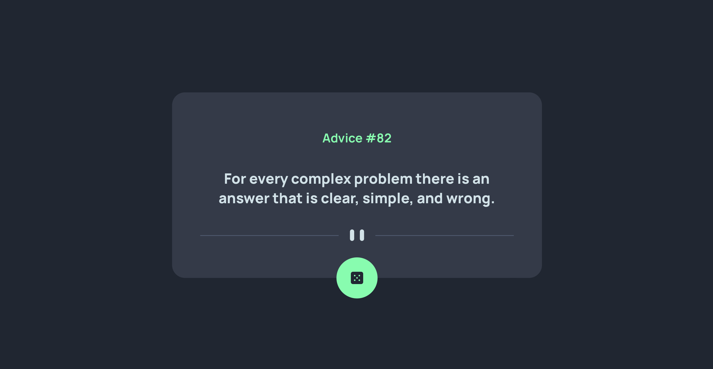

# Frontend Mentor - Advice generator app solution

This is a solution to the [Advice generator app challenge on Frontend Mentor](https://www.frontendmentor.io/challenges/advice-generator-app-QdUG-13db). Frontend Mentor challenges help you improve your coding skills by building realistic projects.

## Table of contents

- [Overview](#overview)
  - [The challenge](#the-challenge)
  - [Screenshot](#screenshot)
  - [Links](#links)
- [My process](#my-process)
  - [Built with](#built-with)
- [Author](#author)

## Overview

### The challenge

Users should be able to:

- View the optimal layout for the app depending on their device's screen size
- See hover states for all interactive elements on the page
- Generate a new piece of advice by clicking the dice icon

### Screenshot

### Links

- Solution URL: [Solution](https://www.frontendmentor.io/solutions/random-advice-react-app-h_yqvDOGBX)
- Live Site URL: [Advice app generator](https://funky-advice-app.netlify.app)

## My process

- create the project using node and React
- create and implement react component
- implement and use API
- shape the interface of the website and use data recived from API
- use CSS to style the interface

### Built with

- Semantic HTML5 markup
- CSS custom properties
- Flexbox
- CSS Grid
- Responsive website
- [React](https://reactjs.org/) - JS library
- [Next.js](https://nextjs.org/) - React framework

## Author

- Linkdin - [Gurău Iulian](https://www.linkedin.com/in/gurău-iulian/)
- Frontend Mentor - [@giulian13](https://www.frontendmentor.io/profile/giulian13)
- GitHub - [@giulian13](https://github.com/giulian13/)
